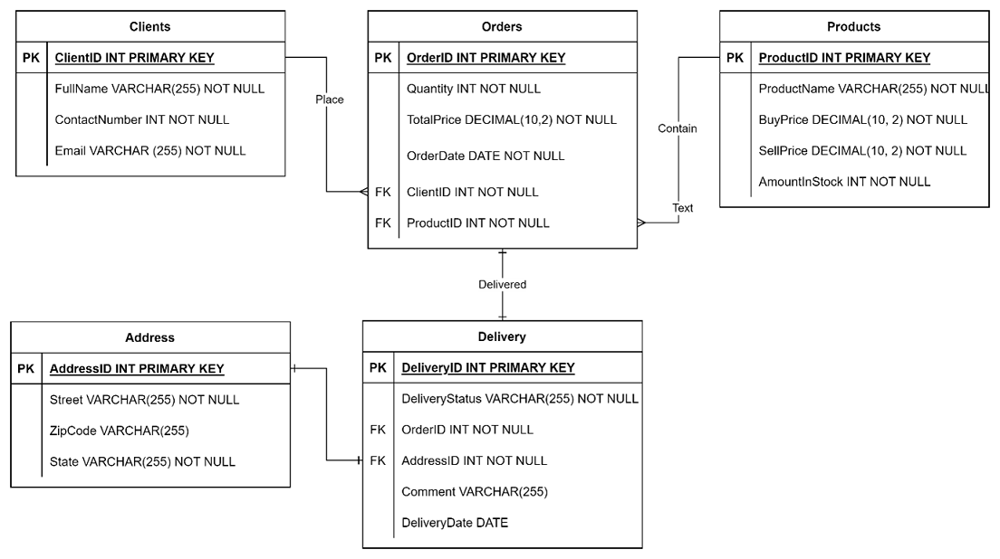
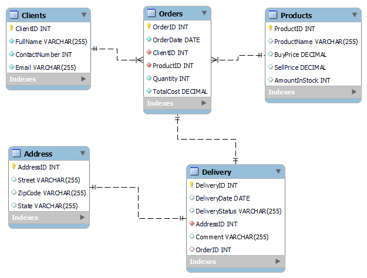

# Exercise: Design a database model in MySQL Workbench
## Introduction
In this exercise you'll design a database model in MySQL Workbench for Mangata & Gallo (M&G) jewelry store.

## Scenario
Mangata & Gallo (M&G) jewelry store wants to make use of the logical database model outlined in the diagram below. You need to help the company to develop this model using MySQL Workbench and implementing it in your MySQL server.



## Instructions

Design and implement a database model in MySQL by completing the following steps. 


### Step 1: Create an ER diagram
Your first step is to use the visual data modeling tool in MySQL Workbench to create the proposed ER diagram for M&G. Your data model should resemble the following diagram.



### Step 2: Implement the internal schema
Next, you need to use MySQL Workbench’s forward engineer feature to implement the internal schema in your MySQL server.

Once you have implemented this feature, you should be able to see your schema implemented in the MySQL Workbench’s SCHEMAS section. 


### Step 3: Populate the M&G database
Next, you need to populate the M&G database with data using the SQL Workbench editor. 
Use the **INSERT** statements code attached in Appendix A. 

M&G wants to create a virtual table so that they can easily find information on their orders. This information must contain data from all tables including:
- Clients, 
- Orders, 
- Products, 
- Delivery 
- and Address.


### Appendix A: INSERT SQL statements:

```sql
INSERT INTO clients
VALUES 
(1, 'Vanessa McCarthy', 757536378, 'vm@mangatagallo.com'), 
(2, 'Marcos Romero', 757536379, 'mr@mangatagallo.com'), 
(3, 'Hiroki Yamane', 757536376, 'hy@mangatagallo.com'), 
(4, 'Anna Iversen', 757536375, 'ai@mangatagallo.com'), 
(5, 'Diana Pinto', 757536374, 'dp@mangatagallo.com');

INSERT INTO products 
VALUES 
(1, 'Engagement ring', 2000, 2500, 25), 
(2, 'Silver brooch', 300, 400, 100), 
(3, 'Earrings', 1000, 1250, 100), 
(4, 'Luxury watch', 500, 800, 50), 
(5, 'Golden bracelet', 800, 1200, 100);

INSERT INTO orders 
VALUES 
(1, '2022-10-15', 1, 1, 1, 2500), 
(2, '2022-10-16', 2, 2, 2, 800), 
(3, '2022-10-17', 3, 5, 1, 800), 
(4, '2022-10-17', 4, 3, 3, 1050), 
(5, '2022-10-18', 5, 4, 1, 1250);

INSERT INTO address
VALUES 
(1, '223 Golden Hills, North Austin, TX', '78758', 'Texas'),
(2, '119 Silver Street, Bouldin Creek, TX', '78737', 'Texas'), 
(3, '785 Bronze Lane, East Austin, TX', '78717', 'Texas'), 
(4, '908 Diamond Crescent, South Lamar, TX','76643 ', 'Texas'), 
(5, '345, Golden Hills, North Austin, TX', '78759', 'Texas'), 
(6, '812, Diamond Crescent, North Burnet, TX', '78611', 'Texas');

INSERT INTO delivery 
VALUES 
(1, '2022-10-17', 'Done', 1, 'None', 1), 
(2, '2022-10-20', 'Done', 2, 'None', 2), 
(3, '2022-10-22', 'Done', 3, 'None', 3), 
(4, '2022-10-25', 'Done', 4, 'None', 4), 
(5, '2022-10-27', 'Done', 5, 'None', 5);
```
